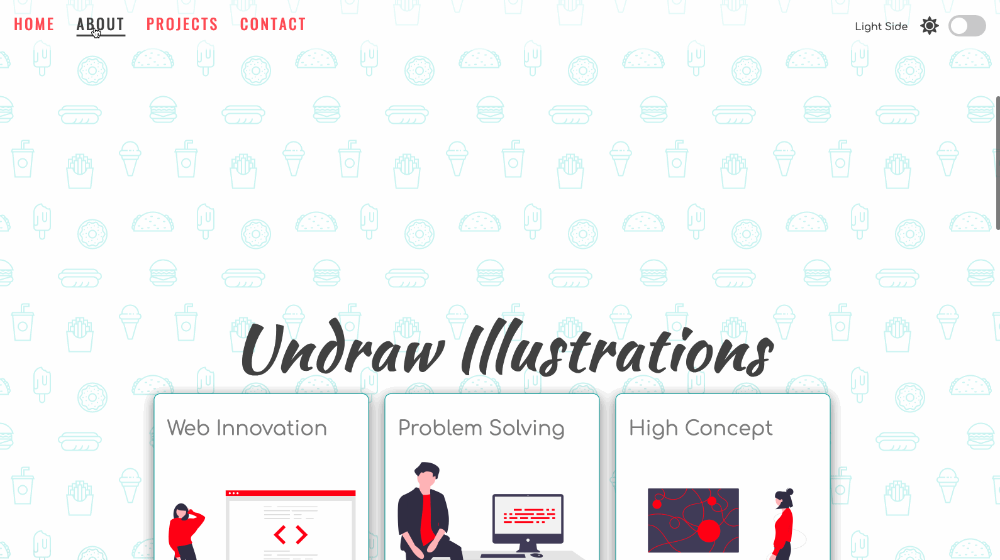

# Light Dark Mode 

This is a project where I worked with light theme and dark theme. It comes with a toggle switch located in the upper right corner to switch between the two themes.
Between themes, the font color, background, images and icons are changed accordingly. 

It also works with the `document.LocalStorage` to store the last theme value that the user chose when he/she last visited the website. Navigation bar is provided to smooth scroll to specific pages.

## Live Demo

Try it out **[here](https://tylernnguyen5.github.io/light-dark-mode/)**

## What I used for this project

- [Font Awesome Icons](https://fontawesome.com/)
- Google Fonts
- [unDraw illustrations](https://undraw.co/illustrations)

## How to try it out yourself locally

- Simply clone the project
- Use **Live Server** or similiar extension to view it in the browser
